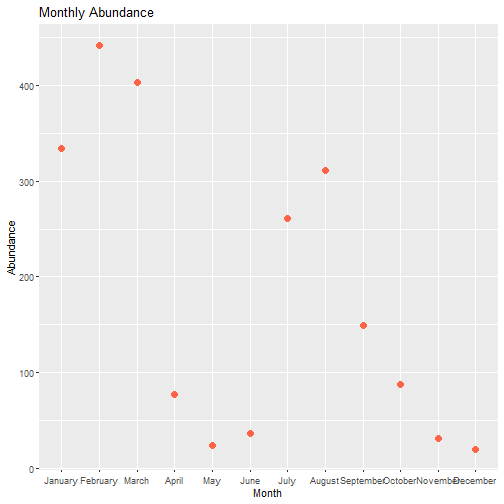
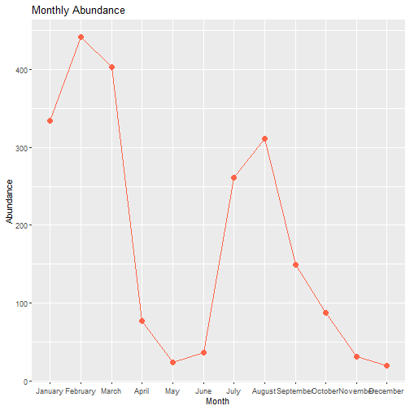
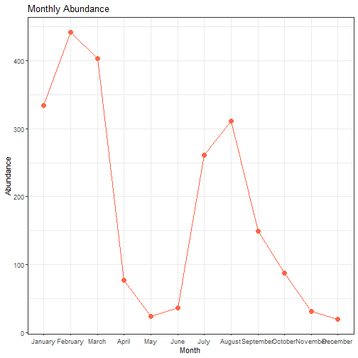
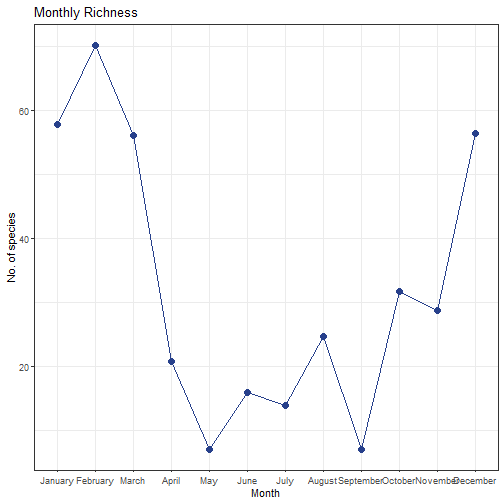
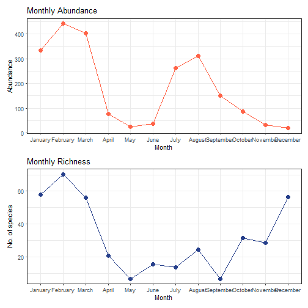

## Plot deconstruction exercise

The purpose of this assignment is to deconstruct a plot and demonstrate how its visualization can be improved using ggplot.


This plot illustrates the abundance and richness of opisthobranch mollusks over the course of a year using a bar graph. However, the bar graph makes it difficult to identify clear patterns. In addition, the two variables are plotted on different scales, which causes richness values to appear disproportionately low compared to the much larger abundance values.

Plot taken from:
Sreeraj, C.R., Sivaperuman, C., Raghunathan, C. (2013). Species Diversity and Abundance of Opisthobranch Molluscs (Gastropoda: Opisthobranchia) in the Coral Reef Environments of Andaman and Nicobar Islands, India. In: Venkataraman, K., Sivaperuman, C., Raghunathan, C. (eds) Ecology and Conservation of Tropical Marine Faunal Communities. Springer, Berlin, Heidelberg. https://doi.org/10.1007/978-3-642-38200-0_6

Since the raw data were not available in the paper, I used https://automeris.io/ to extract data from a screenshot of the plot. The extracted data were then exported as a .csv file and saved in the local folder, after which I processed them in RStudio following the steps below:

### Import Abundance data into R


``` r
abundance <- read.csv("C:/Users/mosac/Desktop/Abundance.csv")
```

### Name the columns as "Month" and "Abundance"

``` r
colnames(abundance) <- c("Month", "Abundance")
```

### Order the months from January to December

``` r
abundance$Month <- factor(abundance$Month, levels = c("January", "February", "March", "April", "May", "June", "July", "August", "September", "October", "November", "December"))
```

### Install tidyverse and execute ggplot

``` r
library(ggplot2)
```

### Plot points

``` r
ggplot(abundance, aes(x = Month, y = Abundance)) +
  geom_point(color = "tomato1", size = 3) +
  labs(title = "Monthly Abundance", x = "Month", y = "Abundance")
```



### Treat all data as one single group to draw a line across points

``` r
ggplot(abundance, aes(x = Month, y = Abundance)) +
  geom_point(color = "tomato1", size = 3) +
  geom_line(aes(group = 1), color = "tomato1") +
  labs(title = "Monthly Abundance", x = "Month", y = "Abundance")
```



### Change background color to white 

``` r
ggplot(abundance, aes(x = Month, y = Abundance)) +
  geom_point(color = "tomato1", size = 3) +
  geom_line(aes(group = 1), color = "tomato1") +
  labs(title = "Monthly Abundance", x = "Month", y = "Abundance") +
  theme_bw()
```



### Import Richness data and plot

``` r
richness <- read.csv("C:/Users/mosac/Desktop/Richness.csv")
colnames(richness) <- c("Month", "Richness")
richness$Month <- factor(richness$Month, levels = c("January", "February", "March", "April", "May", "June", "July", "August", "September", "October", "November", "December"))
ggplot(richness, aes(x = Month, y = Richness)) +
  geom_point(color = "royalblue4", size = 3) +
  geom_line(aes(group = 1), color = "royalblue4") +
  labs(title = "Monthly Richness", x = "Month", y = "No. of species") +
  theme_bw()
```



### Install and execute the patchwork package

``` r
library(patchwork)
```

### Combine the two plots in one layer

``` r
p1 <- ggplot(abundance, aes(x = Month, y = Abundance)) +
  geom_point(color = "tomato1", size = 3) +
  geom_line(aes(group = 1), color = "tomato1") +
  labs(title = "Monthly Abundance", x = "Month", y = "Abundance") +
  theme_bw()

p2 <- ggplot(richness, aes(x = Month, y = Richness)) +
  geom_point(color = "royalblue4", size = 3) +
  geom_line(aes(group = 1), color = "royalblue4") +
  labs(title = "Monthly Richness", x = "Month", y = "No. of species") +
  theme_bw()

p1/p2
```



In this revised version of the plot, the patterns in abundance and richness throughout the year are easier to interpret. Because each variable is now displayed on its own scale, it is easier to track how abundance and richness fluctuate month by month, providing a clearer basis for interpretation and further discussion.

### Save the final plot

``` r
ggsave("AbundancevsRichness.jpg")
```

```
## Saving 7 x 7 in image
```
